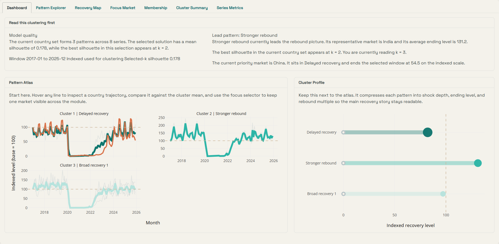

```{r, include=FALSE}
shiny_app_url <- trimws(Sys.getenv("SHINY_APP_URL", unset = ""))
shiny_launch_href <- if (nzchar(shiny_app_url)) shiny_app_url else "./app-guide.html"
shiny_launch_label <- if (nzchar(shiny_app_url)) "Launch Live Shiny App" else "Open Shiny Setup"
```

::: {.home-hero}
::: {.home-hero-copy}
<div class="home-eyebrow">Singapore Tourism Recovery | Visual Analytics Project</div>

# Singapore Tourism Time-Series Visual Analytics

This project studies tourism recovery as a comparative time-series problem. The site and the app work together: the website documents the analytical story, while the Shiny app lets users explore market structure, compare recovery trajectories, and run forward forecasts on a shared arrivals backbone.

::: {.home-actions}
[Open Shiny App](`r shiny_launch_href`){target="_blank" .btn-home-primary}
[Read User Guide](./user-guide.html){.btn-home-secondary}
[View Poster](./poster.html){.btn-home-secondary}
:::

::: {.home-proof}
<div><span>Live modules</span><strong>Visual Analysis, Clustering, Forecasting</strong></div>
<div><span>Shared backbone</span><strong>Country-level visitor arrivals</strong></div>
<div><span>Deployment</span><strong>`r if (nzchar(shiny_app_url)) "shinyapps.io connected" else "render without SHINY_APP_URL"`</strong></div>
:::
:::

::: {.home-hero-media}
{.img-fluid}
:::
:::

## What This System Answers

::: {.home-insight-band}
::: {.home-insight}
### Market Structure

The visual analysis module shows how source-market concentration changes across pre-COVID, shock, and recovery periods. It helps readers understand who the leading markets are before they move into deeper modelling.
:::

::: {.home-insight}
### Recovery Patterns

The clustering module groups country trajectories by recovery shape. It reveals which markets recovered together, which remained delayed, and where a selected priority market sits in the wider landscape.
:::

::: {.home-insight}
### Forward Projection

The forecasting module compares baseline and model-based forecasts on a holdout window, then places the selected arrivals series next to hotel occupancy, stay length, and room revenue context.
:::
:::

## One Workflow, Three Modules

::: {.home-workflow}
::: {.home-workflow-step}
<div class="home-step-kicker">Module 1</div>
### Time Series Visual Analysis

Start with the market map and the period ranking view. This establishes the source-market structure, the current leaders, and the shift from pre-COVID to recovery.
:::

::: {.home-workflow-step}
<div class="home-step-kicker">Module 2</div>
### Time Series Clustering

Move into the guided clustering workspace to inspect pattern quality, representative trajectories, recovery position, and focus-market placement.
:::

::: {.home-workflow-step}
<div class="home-step-kicker">Module 3</div>
### Forecasting

Finish in the forecasting studio to compare model families, inspect diagnostics, and explain the winning forecast with tourism-performance context.
:::
:::

## Deliverables On This Site

::: {.home-deliverables}
<a class="home-deliverable" href="./Proposal/Proposal.html">
<span>Proposal</span>
<strong>Project framing, scope, and analytical direction</strong>
</a>
<a class="home-deliverable" href="./app-guide.html">
<span>Shiny App</span>
<strong>Launch page, deployment target, and embedded preview</strong>
</a>
<a class="home-deliverable" href="./user-guide.html">
<span>User Guide</span>
<strong>Merged EDA, clustering, and forecasting walkthrough</strong>
</a>
<a class="home-deliverable" href="./poster.html">
<span>Poster</span>
<strong>Final project poster in website form</strong>
</a>
<a class="home-deliverable" href="./prototype/ui-storyboard.html">
<span>Storyboard</span>
<strong>UI story and prototype flow across the app</strong>
</a>
<a class="home-deliverable" href="./Meeting%20Minutes/first-meeting-record.html">
<span>Meeting Minutes</span>
<strong>Decision trail, task ownership, and pivot history</strong>
</a>
:::

## Analysis Pages And Prototypes

::: {.home-link-grid}
<a href="./prototype/EDA.html">EDA prototype</a>
<a href="./prototype/CDA.html">CDA prototype</a>
<a href="./prototype/module-cluster.html">Clustering prototype</a>
<a href="./prototype/forecasting.html">Forecasting prototype</a>
<a href="./Meeting%20Minutes/first-meeting-record.html">First meeting record</a>
<a href="./Meeting%20Minutes/second-meeting-record.html">Pivot meeting record</a>
:::

## Data Contract And Deployment

The site and the Shiny application are aligned to one shared arrivals backbone. The common arrival series live in `data/raw/visitor_arrivals_full_dataset.xlsx`, the EDA and ranking views use processed arrivals tables under `data/processed/`, clustering reads the coordinated clustering artifacts under `data/processed/`, and forecasting layers in `data/raw/tourism_update.xlsx` for optional tourism-performance context.

`r if (nzchar(shiny_app_url)) paste("The current website render points to:", shiny_app_url) else "This render does not yet have SHINY_APP_URL injected, so the launch button falls back to the Shiny setup page."`

## Local Run

```bash
quarto preview
```

```bash
Rscript run_app.R 3838
```
