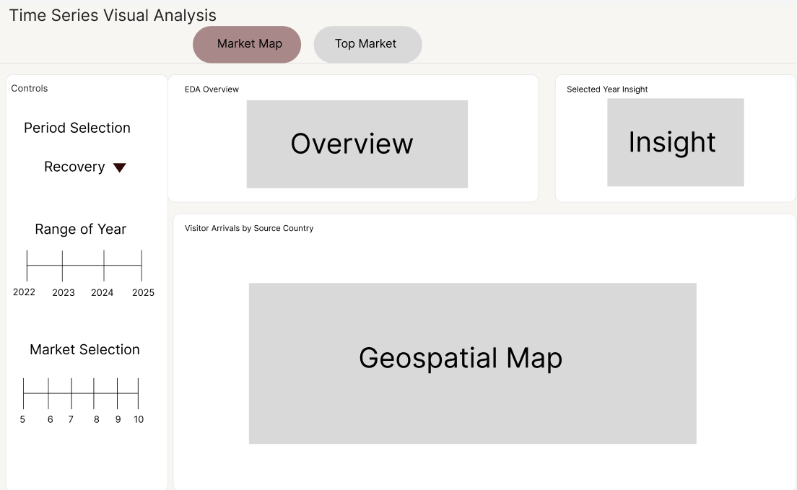
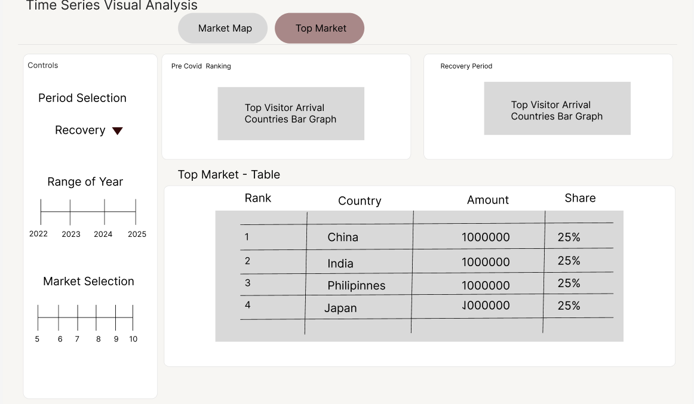
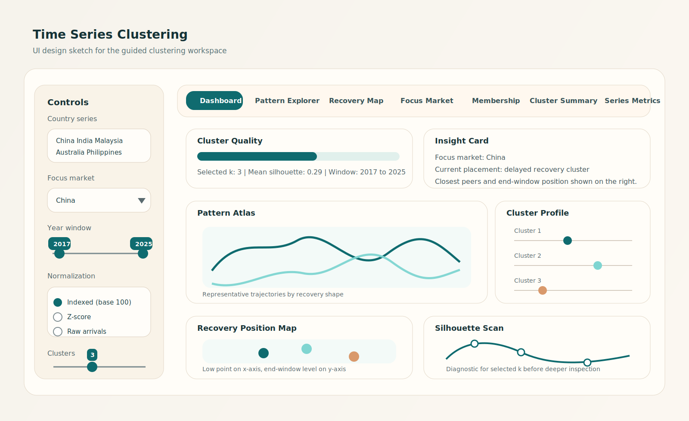

## Design Scope

This page records the interface direction for the final application. Each module is shown as a working screen rather than a process diagram, so the emphasis stays on layout, visual hierarchy, and the relationship between controls and outputs.

## EDA and CDA Design Reference

{.img-fluid .guide-figure}

The first EDA reference shows the `Market Map` tab. The Visual Analysis design uses a narrow control rail on the left and a two-layer analytical surface on the right. The first layer contains an overview card and an insight card, which gives the user a fast reading of the selected period before moving into the main map or ranking view. The second layer allocates most of the width to the geospatial panel, because this module is about source-market structure and leadership patterns across periods.

{.img-fluid .guide-figure}

The second EDA reference shows the `Top Market` tab. This view uses the same controls, but shifts the analytical emphasis from spatial coverage to ranked market comparison. Two bar-chart panels compare the pre-COVID and recovery periods side by side, and the ranking table below turns that comparison into a reporting surface with rank, country, volume, and share. The tab split keeps the module readable at a glance, because the user can move between a spatial market overview and a structured period-to-period ranking view without changing the control logic.

## Clustering Workspace Design

{.img-fluid .guide-figure}

The clustering workspace is designed as the densest analytical surface in the app, so the sketch gives the right side to a tabbed results area and keeps the left side for all parameter choices. The control rail holds the country set, focus market, time window, normalization mode, and cluster count in one vertical sequence, which matches the order in which the user prepares a clustering run.

The results area begins with a dashboard strip for cluster quality and a short insight summary. Below that, the screen is divided into a pattern atlas, a compact cluster profile, a recovery position map, and a silhouette diagnostic. This arrangement makes the main reasoning path explicit. The user first checks whether the clustering is stable, then reads the representative trajectories, then verifies where the focus market sits in the wider recovery landscape.

The tab row across the top reflects the final module structure in the live app. `Dashboard` anchors the first reading. `Pattern Explorer` supports deeper trajectory inspection. `Recovery Map` and `Focus Market` isolate the comparative placement task. `Membership`, `Cluster Summary`, and `Series Metrics` are treated as reporting and export views.

## Forecasting Studio Design

{.img-fluid .guide-figure}

The forecasting module keeps the same left-control and right-workspace principle, but the output area is organized around model evaluation instead of clustering comparison. The primary chart compares holdout behaviour and forward projection, while the supporting views break the interpretation into model diagnostics, decomposition, and tourism-performance context.

The design objective is analytical continuity across modules. Visual Analysis establishes structure. Clustering explains grouped recovery behaviour. Forecasting then projects one selected series forward using the same country-level backbone. The interface language therefore stays stable from one module to the next even though the analytical task changes.

## Shared Design Logic

The three modules use the same visual grammar. Controls stay on the left. Interpretation begins with summary content near the top of the working area. Large visual panels occupy the central reading space. Tables and export views are pushed to secondary tabs or lower-priority regions. This consistency helps the app feel like one integrated analytical product instead of three unrelated screens.
