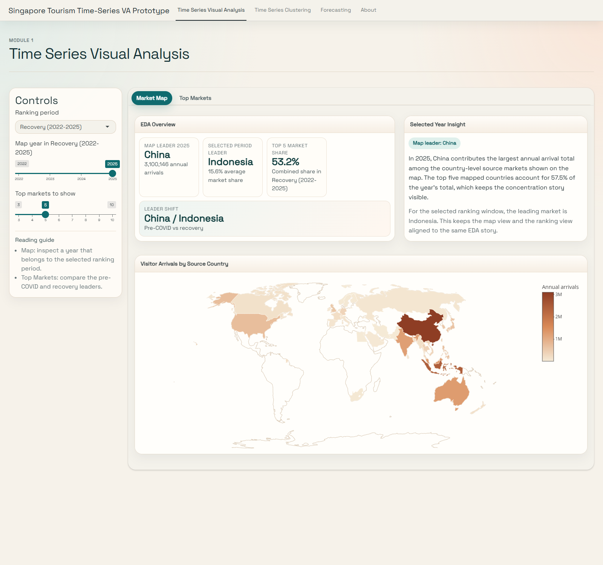
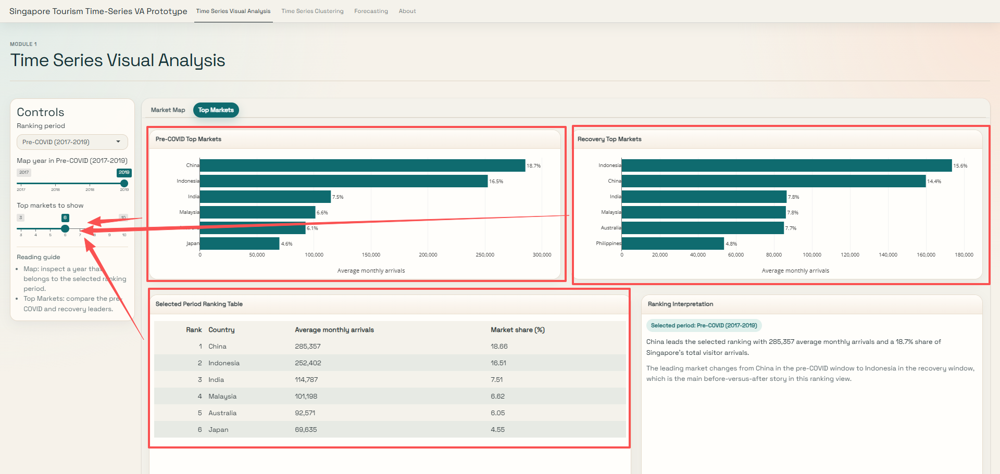
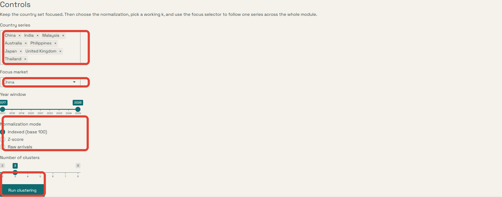
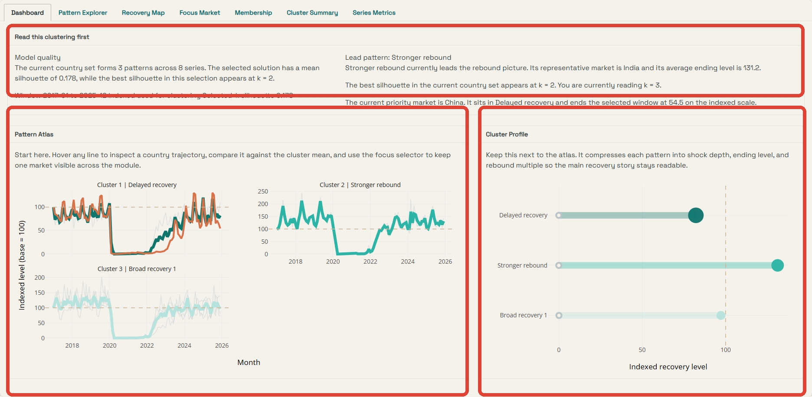
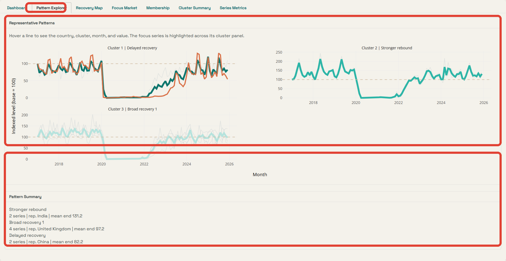
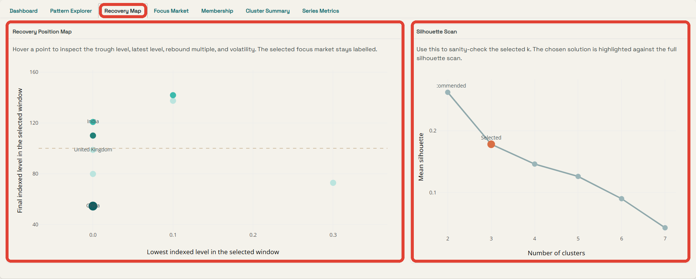
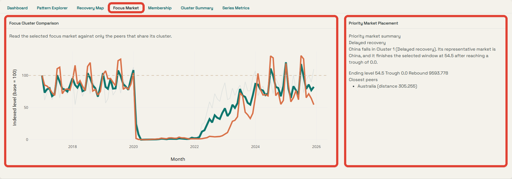
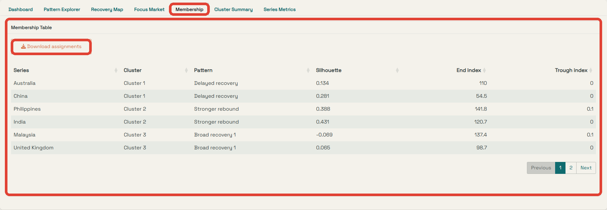
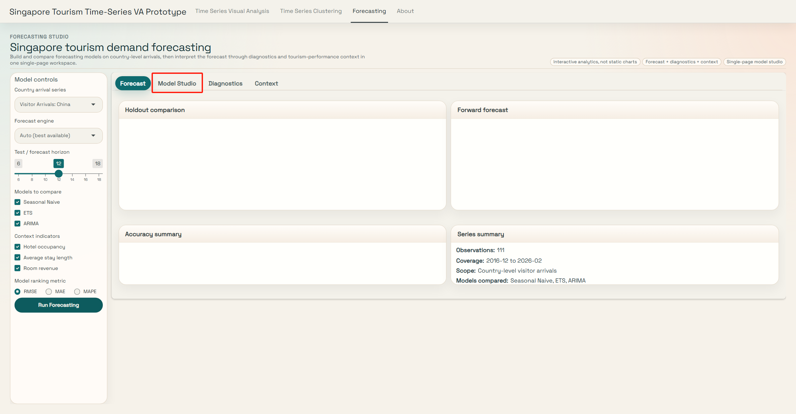
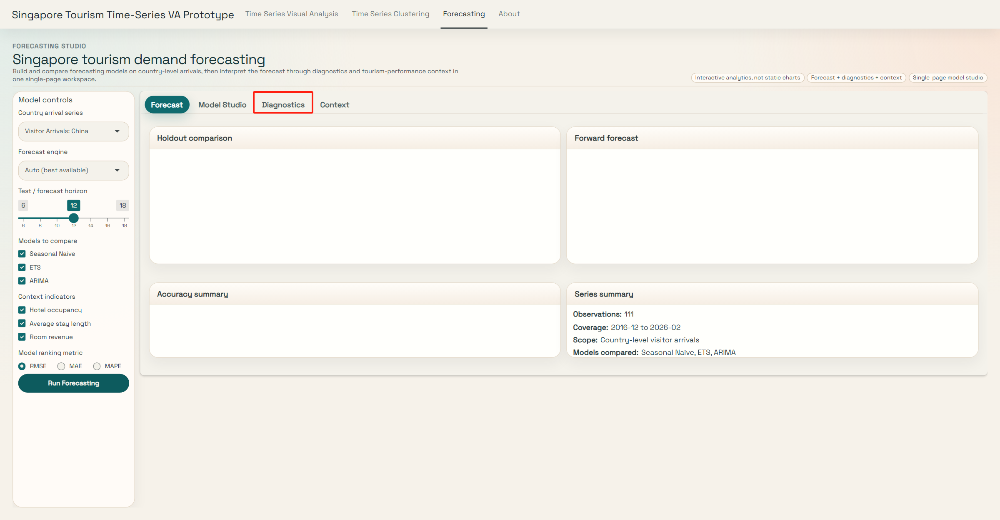

## Purpose

This guide explains how to use the final tourism analytics app as one connected workflow. The three analytical modules share the same country-arrivals backbone, so the intended reading order is to begin with market structure, continue into recovery-pattern comparison, and finish with forward projection.

## App Structure

The live Shiny app is organised into four top-level tabs: `Time Series Visual Analysis`, `Time Series Clustering`, `Forecasting`, and `About`. The first three tabs do the analytical work. The `About` tab summarises the shared data contract and the role of each module inside the integrated build.

{.img-fluid .guide-figure}

Use the top navigation to move between modules. The workflow is designed to be read from left to right. `Time Series Visual Analysis` establishes market structure, `Time Series Clustering` compares recovery shapes, and `Forecasting` turns one selected arrivals series into a forward-looking model comparison.

## Shared Data Scope

The app uses one coordinated data stack:

- `data/raw/visitor_arrivals_full_dataset.xlsx`
- `data/processed/arrivals_country_long.csv`
- `data/processed/arrivals_country_wide.csv`
- `data/processed/clustering_country_wide.csv`
- `data/processed/clustering_country_long.csv`
- `data/processed/clustering_series_metadata.csv`
- `data/raw/tourism_update.xlsx` for optional tourism-performance context

Country-level visitor arrivals remain the common analytical target across visual analysis, clustering, and forecasting.

## Time Series Visual Analysis

Open the `Time Series Visual Analysis` tab when you want to establish market structure before moving into clustering or forecasting. This module is the first analytical stop because it shows which source markets dominate each period and how the ranking structure changes between the pre-COVID and recovery windows.

{.img-fluid .guide-figure}

### Step 1: Configure the market-structure view

Start from the control panel. `Ranking period` determines which analytical window is active. `Map year` lets you move inside that chosen period. `Top markets to show` controls the ranking depth used in the comparison page. These three inputs should always be read together because the map and ranking story are designed to stay aligned.

### Step 2: Read the Market Map first

The `Market Map` page shows annual country totals on a choropleth map. Read the overview cards first, then use the selected-year insight panel to connect the map leader to the chosen ranking window. This page answers which markets dominate a given year, how concentrated the visible recovery landscape is, and whether the market leader in the selected year is consistent with the wider period story.

{.img-fluid .guide-figure}

### Step 3: Compare the pre-COVID and recovery leaders

The `Top Markets` page compares the pre-COVID and recovery leaders side by side. The ranking charts and interpretation card explain how the leading source markets change between the two periods. Use this page when you need to show whether the same countries still lead in the recovery window, whether the top-ranked market changes across periods, and how concentrated the market structure remains after recovery.

## Time Series Clustering

Open the `Time Series Clustering` tab when you want to group country trajectories by recovery shape. The clustering unit is a country-level time series, not an individual month, so every result in this module should be read as a recovery-path comparison.

### Step 1: Configure the clustering run

Start in the left control panel. Select a focused set of country series, choose a priority market, set the year window, choose the normalization mode, and set the working value of `k`. After the inputs match the comparison you want, click `Run clustering`.

{.img-fluid .guide-figure}

The `Country series` input defines the comparison set. The `Focus market` control tells the module which market to keep visible across the guided pages. The normalization mode changes the analytical emphasis. `Indexed (base 100)` is the most direct choice when you want to compare relative recovery shape. `Z-score` is useful when you want the comparison to focus on standardized variation. `Raw arrivals` keeps the scale in actual arrivals and therefore highlights size differences.

### Step 2: Read the dashboard before the detailed views

The `Dashboard` page is the first analytical stop after each run. The summary band reports fit quality, the lead pattern, and the current priority-market position. The `Pattern Atlas` then shows the representative trajectories for each cluster, while `Cluster Profile` compresses each pattern into shock depth, ending level, and rebound strength.

{.img-fluid .guide-figure}

Use this page to answer three questions. First, is the selected `k` reasonably stable for the current country set. Second, what are the dominant recovery patterns. Third, where does the focus market sit relative to the strongest and weakest rebound groups.

### Step 3: Inspect trajectory shape in Pattern Explorer

Move next to `Pattern Explorer`. This page lays out the representative patterns in detail and adds a compact `Pattern Summary` block beneath the plot. Hovering any line reveals the country, cluster, month, and indexed level, which makes the grouping interpretable at the individual-series level.

{.img-fluid .guide-figure}

This page is useful when you need to explain why two markets were placed into the same cluster. The cluster mean gives the dominant path. The lighter background lines show how much variation remains inside the group. The summary strip underneath tells you which market is most representative of that pattern and what ending level the cluster reaches on average.

### Step 4: Check the recovery position and the selected k

The `Recovery Map` page reduces each series to key recovery metrics. The left panel places every market in a two-dimensional recovery space defined by lowest indexed level and final indexed level. The right panel shows the silhouette scan, which is the quickest diagnostic for whether the selected `k` is still defensible relative to the nearby alternatives.

{.img-fluid .guide-figure}

Read the recovery map as a compact structural summary. Points that finish higher on the vertical axis end the window in a stronger state. Points further to the right experienced a less severe trough in the selected window. The silhouette scan should be interpreted as model-quality evidence, not as the only decision rule, because interpretability and business meaning still matter.

### Step 5: Trace one priority market through its cluster

The `Focus Market` page takes the selected market and places it back inside its own cluster. The left panel compares the focus market against the peers that share its pattern. The right panel summarises the market's assigned cluster, its ending level, trough level, rebound multiple, and closest peers.

{.img-fluid .guide-figure}

This is the best page to use during a presentation when you want to explain one country in context. Instead of reading the focus market in isolation, the module shows whether it is a representative case, a boundary case, or an unusually volatile member of its group.

### Step 6: Export assignments and review the metrics tables

After the pattern interpretation is clear, move to `Membership`, `Cluster Summary`, and `Series Metrics`. The membership table records the final assignments for each country and provides a download button. The other two tables summarise cluster-level and series-level metrics for reporting and follow-up work.

{.img-fluid .guide-figure}

Use `Membership` when you need the final output table. Use `Cluster Summary` when you want a compact comparison of the cluster-level statistics. Use `Series Metrics` when you need series-level values such as ending index, trough index, rebound multiple, and volatility.

## Forecasting

Open the `Forecasting` tab when you want to project one country-level arrivals series forward and compare model families on a time-aware holdout window.

{.img-fluid .guide-figure}

### Step 1: Configure the forecasting run

The left control panel sets up one forecasting run. Choose the `Country arrival series`, the `Forecast engine`, the `Test / forecast horizon`, the `Models to compare`, the optional `Context indicators`, and the `Model ranking metric`. The module does not re-run automatically. Click `Run Forecasting` after you change any of those settings.

### Step 2: Know what requires a rerun

The following controls affect the forecast results and therefore require a fresh click on `Run Forecasting`:

- `Country arrival series`
- `Forecast engine`
- `Test / forecast horizon`
- `Models to compare`
- `Model ranking metric`

### Step 3: Read the Forecast tab first

{.img-fluid .guide-figure}

The `Forecast` tab is the main results page. `Holdout comparison` shows how the selected models perform on unseen months. `Forward forecast` displays the future projection from the best model under the chosen ranking metric from the most recent run. `Accuracy summary` translates the score table into readable model comparisons. `Series summary` confirms the date coverage, observation count, and current model scope.

### Step 4: Use Model Studio to explain why one model wins

{.img-fluid .guide-figure}

The `Model Studio` tab explains why one model wins. `Model leaderboard` ranks the models under `RMSE`, `MAE`, or `MAPE`. `Holdout residual comparison` shows where forecast errors remain on the holdout window. `Engine status` reports which engine was requested, which one actually executed, and which packages are missing when the strict `Require modeltime` path cannot run. `Model interpretation` turns the ranking result into a plain-language explanation. This page is the fastest way to explain why the selected best model is defensible.

### Step 5: Use Diagnostics for structure checking

{.img-fluid .guide-figure}

The `Diagnostics` tab focuses on time-series structure. `Raw time series` shows the full historical path. `Seasonal pattern` reveals month-level recurrence across years. `Decomposition` separates the series into trend, seasonal, and remainder components. `Split summary` confirms the training and testing window used in the latest run.

### Step 6: Use Context for business interpretation

{.img-fluid .guide-figure}

The `Context` tab places the arrivals series next to hotel occupancy, average length of stay, and room revenue. These context indicators are normalized for comparison, so the chart should be read as a relationship view rather than a direct scale comparison.

## Recommended Reading Order

Begin in `Time Series Visual Analysis` to establish which source markets lead and how concentration shifts across periods. Continue into `Time Series Clustering` to compare recovery shapes and place a focus market into a structured pattern. Finish in `Forecasting` to build a forward projection and interpret it with diagnostics and tourism-performance context.
